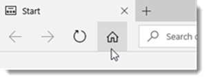
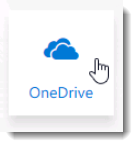
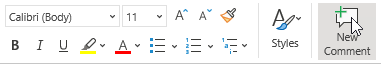
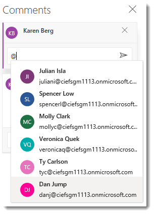
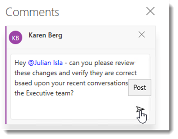
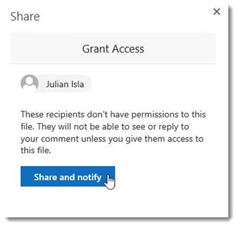
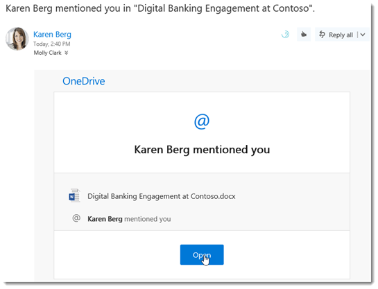
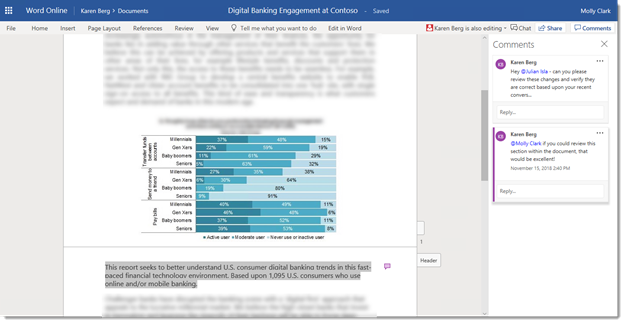

# Financial Services Guide for Customer Immersion Experience

Karen Berg, the Director of Operations and Business Strategy for Contoso Financial Partners, and has been working on a document for Contoso’s newest regional expansion.  She wants to share her document with her colleagues, Julian Isla and Molly Clark, to review and edit before sending it to the rest of the operations department.  Prior to Office 365, Karen would have emailed the document to her colleagues and scheduled individual phone calls to discuss edits—neither of which are an efficient use of Karen’s time.  But today, Karen uses a host of connected solutions to complete this process faster without sacrificing quality.

Karen will start the process going into her OneDrive where she safely saves all of her files so that they follow her across all her devices.  She will **launch Edge** from her task bar and **click** the **Home button** to automatically connect and sign into her Office 365 account.

She will **select** the **waffle** icon in the upper left-hand corner and **click** the **OneDrive** tile.

She needs to collaborate on a document with Julian and Molly.  To do this, Karen will **select** the **Digital Banking Engagement at Contoso.docx** document from her OneDrive to open it in Word Online.  She can choose to direct each of her colleagues attention to any given location within the document by using the new @mentions in comments to tag someone for feedback.

If she selects any specific text or object a the mini toolbar will appear, allowing her to choose various formatting options as well as the ability to select **New Comment** at the end of the mini-toolbar.

Karen will begin to enter a quick note making sure to type the **@** symbol which will trigger a drop down list that she can choose the person to @mention, in this case Julian **Isla**.

For example: *Hey @Julian Isla - can you please review these changes and verify they are correct based upon your recent conversations with the Executive team?*  before **clicking Post**.

Because she has posted her comments with an @mention to Julian, she will be prompted and will choose to **Share and notify**.

> [!TIP]
> Facilitators Note:  This is an opportunity to encourage group participation within your session, by using the  @mention feature to pull in as many participants as possible.  Repeat the comments for each of your session participants at various locations throughout the document.  Each recipient will receive an email similar to the screen below…

>[TIP]
> …which allows them to join a co-authoring session within the document with the comments bar appearing on the right hand side.

Karen sees Julian is now editing and will click the Chat icon in the upper right-hand corner, to start a group chat with Julian and whoever else she has joined her to co-author the document.  
 

 
This launches a group chat conversation.  Here we can type “Thanks for jumping in so quickly to help me revise this document!” and hit Enter to send the message.
 

 
Other participants editing will receive notifications and can choose to open the Chat panel to engage in conversation.  
 

Facilitators Note:  While the Word online app is great and accessible from any modern browser, Karen is working from her Surface device so she would like to make use of the rich features in the Word desktop app she has pre-installed.  
 
SPEAKER GUIDANCE: Depending upon whether you have the new "Simplified Ribbon" or not this click path may vary.  If you do see the Simplified Ribbon, then you should see the Open in Word button, but if not, then you will click the Chat button in order to retract the chat panel, so that you can then click Edit in Word. 
 

 
Julian and Molly will continue to work on the document throughout the day.  When finished, they ask Karen to open the document and review their work.  Karen first uses Windows Ink Markup on her touch tablet to make initial edits.
 
VIRTUAL SESSION GUIDANCE: While using virtual CIE to deliver sessions is great for convenience there are some steps within our guide that are best experienced on physical devices, especially those which require HD graphics, Audio / Video, Biometrics, Touch, Dial or Pen support.  If you are using an unsupported device and the Draw tab is not visible in the Word ribbon, you can activate it by right clicking on the taskbar and then select Show Windows Ink Workspace button.  
 

 
Then go to Word and click on File > Options > Customize Ribbon and check the box next to Draw and click OK.
 

 
To continue with Inking in Office, she will select the Draw tab in the ribbon, and then select Ink Editor, Draw with Touch (if you are without a Surface Pen), and finally she will select the red pen.
 

 
SPEAKER GUIDANCE: This would be a good time to talk about inking with touch or to use a pen-enabled device.  The ideal way to showcase Windows Ink Markup is with a pen, which are more natural than a mouse.  The value here is that users can stay productive from anywhere and use mark-up capabilities that best fit their natural gestures and/or their device's capabilities.
 
Karen will use her Surface Pen or drag her mouse over any line within the document.  This deletes that part of the line in real time.  She can delete large chunks of text by drawing a diagonal line or up-and-down squiggles.
 
Other Ink Editor tasks include: the ability to draw a circle around the text if she wants to select.  She can select 
words, sentences or paragraphs and then apply formatting like font color, bold, or italic.  She can draw a curved line beneath that joins two words, making sure both ends of the curve touch the words that she wants to join.  Draw a vertical line within a word to split it in two or draw a caret between two words to insert text.  After drawing the caret, she can write the words she wants to add and when done writing, the text is inserted where she drew the caret.
 

 

Facilitators Note:  If you wish to keep a record of your ink edits, you should turn on Track Changes in Simple Markup mode on the Review tab before you start reviewing your document using Ink Editor.
 
Karen clicks the Stop Inking button to deactivate the Inking feature.
 
PRODUCT NOTE: Real-time coauthoring capabilities are also available with Word, PowerPoint, and Excel mobile apps across Windows, Android, and iOS devices. 
 
After Karen finishes her edits, she would like to quickly ask a vendor to review and edit before she locks the document for the Marketing team.  She will click the Share button.
 

 
She will select Anyone with this link can edit >  so that she can choose an alternative set of controls and recipient type for her link settings. 
 

 
Here in the Link settings she can choose to Set expiration date or to Allow editing but in this case she would like to send this document link externally to a vendor and so she will choose Specific people and Allow editing and finally Apply.  
 

 
Here Karen can enter any email address, including those outside the organization, to share the document from her OneDrive securely with her vendor who has decided to use their Gmail account for business purposes.  She will enter a brief message to notify the recipient of her expectations and then click Send.
 
SPEAKER GUIDANCE: If you choose to share this document externally (as outlined in this guide) then you must disable/uncheck the Exchange Transport rule that is discussed in the Technical Guide, under Security Considerations. Otherwise the email will never reach the sharing recipient as it will be blocked and deleted.
 

 
The recipient who receives the email as shown below can click Open…
 

 
…which will then ask the vendor to confirm their identity with Microsoft OneDrive verification code by copying / pasting from the email they receive at that same Gmail address.
 

 
Notice the co-authoring experience continues, even with the external vendors outside of the organization.
 

 
Office 365 gives Karen and her team a host of connected collaboration capabilities to quickly produce a critical document without sacrificing quality.  Real-time coauthoring enables everyone to work on the document simultaneously, reducing version-control issues.  Along with built-in inking tools give the team new ways to edit and add content to working documents, including Word, Excel or PowerPoint files.  All this is available across devices, which means Karen and her team can stay productive from virtually anywhere.
 
Scenario 3
Alan Steiner is the Vice President of Corporate Marketing at Contoso Financial Partners, a large multinational banking, insurance, and wealth management firm. Each year, the firm updates its portfolio of financial services for all of its global regions (Americas, Asia/Middle East/Africa, Australia/Pacific and Europe) with representatives from each region collaborating on the portfolio. Alan manages the creation of various marketing materials associated with the annual portfolio update, such as prospectuses, brochures, blog articles, interviews, and the annual press release announcement.
 
In previous years, Alan would spend much of his time managing feedback on the press release draft document from various stakeholders and representatives in the different global regions. Some of that feedback came by email, creating long and complex threads that were hard to follow. Other feedback and comments came in ad hoc phone calls or short in-person meetings, during which Alan would take detailed notes in an effort to capture as much of the input as possible. All in all, writing the press release was a tedious and complex process that always took longer than expected.
 
With Office 365, Alan can now streamline the process of drafting the press release and consolidating feedback with a set of connected, intuitive tools that enable real-time collaboration and coauthoring—meaning he spends less time managing feedback and more time on value-added activities, such as ensuring the accuracy and quality of the final press release.
 
Today, Alan is launching the effort to plan and coordinate this year's marketing portfolio updates, including the press release announcement. He’ll create an integrated collaboration experience for team members to coordinate on various activities. Alan has created as an initial draft of the press release and is ready to solicit additional input and feedback from the stakeholders and regional representatives on the team.
 
He opens Edge from his task bar and clicks the Home button to automatically sign into his Office 365 account.
 

 
Alan then selects Teams.
 

 
Alan is going to create a dedicated team for the annual portfolio update. To do this, he clicks on Teams in the left menu and selects Join or create a team in the bottom left-hand corner…
 

 
…then clicks Create team.
 

 
Alan types the following into the “Team name” and “Description” fields:
 
Team name: “Annual Financial Portfolio Update”
Description: “Team site to plan and coordinate annual updates to Contoso’s global financial services portfolio offerings.”
 
He leaves the default privacy setting to “Private” and clicks Create a team from an existing Office 365 group. 
 

 
Office 365 Groups enhances collaboration by connecting content from across Office 365 solutions, including Teams, SharePoint, and Outlook, so group members can access shared files, calendars, conversations, and more from any solution. By adding Teams functionality, Alan can connect to the existing Annual Financial Portfolio Update group, and existing group members will be added to the team automatically. 
 
In the Choose your team screen, Alan selects the Annual Financial Portfolio Update group and clicks Choose team at the bottom. 
 

 
Teams offers a feature called “Channels,” which act as subsites under the umbrella team. Subsites give team members a dedicated site for coordinating on specific activities. In Alan's case, he’ll eventually create channels under the Annual Financial Portfolio Update team for things like prospectuses, brochures, and blog articles. But for now, he needs a dedicated channel where he can coordinate on the press release with Molly and Diane.
 
Alan clicks Create more channels… 
 

 
…then types the following in the “Channel name” and “Description (optional)” text fields:
·         Channel name: “Press Release”
·         Description (optional): “Channel for coordinating feedback on the annual press release”
 
Lastly, he clicks Add.
 

 
PRODUCT NOTE: Users can also add a variety of connectors through Teams to automatically surface things like notifications, announcements, and posts from other solutions, including non-Microsoft connectors.
 
Alan wants to review the press release with Molly and Diane tomorrow morning. To do this, he needs to give them access to the document. 
 
He clicks Files, then Upload at the top of the window.
 

 
 
He selects the Contoso_Press_Release.docx file in his OneDrive files, then clicks Open
 

 
and uploads it to the Press Release channel. The file is now available to everyone in the Annual Financial Portfolio Update team.
 

 
Alan’s day is almost over. But before heading home, he needs to ask Molly and Diane to coauthor the document with him first thing tomorrow morning. He clicks Conversations at the top of the window…
 

 
…and types the following message in the bottom text field: “Hi @Molly Clark and @Diane Prescott! I just uploaded my draft of the press release to the files library. Let’s meet in Word Online at 9 a.m. tomorrow to discuss. Thanks!” He then clicks the paper airplane icon in the lower right-hand corner to send the message.
 
PRODUCT NOTE: Using @mentions automatically displays team members’ names to expedite the selection process. Plus, mentioned team members will receive an email notification about the conversation. 
 

 
PRODUCT NOTE: Teams also offers voice and video meetings, but only through the client at this time.
 
Alan goes home feeling optimistic about this year’s marketing efforts for the annual press release.
 
The next morning, Alan starts his day in Outlook. He navigates to his Office 365 homepage and selects Outlook.
 
SPEAKER GUIDANCE: It’s likely participants still have their Office 365 homepage open, either in a separate browser window or tab. Direct them back to that page.
 

 
In Outlook, under Groups, he finds the Annual Financial Portfolio Update group he used to create his team. He notices the group has a new message. He clicks the link in the left pane to find out more. 
 

 
Great news! I was talking with @Jamie Reding this morning and she has generated some excitement in her commercial accounts around our new portfolio offerings. As a result of her efforts, this year's press release announcement is being picked up by more than a dozen additional media outlets in Europe and Asia. Alan responds to Molly's message by clicking Reply all at the bottom of the window…
 

 
…and typing, “This is fantastic! I’ll add this news to our SharePoint team site for greater visibility.” He then clicks Send. 
 

 
Office 365 Groups will retain this message in the team’s Annual Financial Portfolio Update group so others can see and respond to it in the future. 
 
PRODUCT NOTE: With integrated presence information from Teams (notice the status indicators inside the profile photos of your contacts) you can easily start calls, IMs, and emails with your contacts.
 
Alan now needs to add the media outlet participation news to the team’s SharePoint Team News feed as promised in his response to the group conversation. Team News is a great way to broadcast what’s happening for a specific engagement—in this case, coordinating the press release. 
 
To access the SharePoint team site, Alan clicks the ellipses (…) then selects Site at the top of the screen.
 

 
This opens the Annual Financial Portfolio Update team site in SharePoint, which was automatically created when Alan added the corresponding Teams site yesterday. From here, he clicks Add news.
 

 
In the “Name your page” text field, Alan types “New media outlets in Europe and Asia!” and then clicks the plus sign, then the text box in the subsequent window.
 

 
Lastly, he types the following message to recap the news from Molly: “Great news, everyone! Jamie Reding says we have more than a dozen additional media outlets in Europe and Asia that are picking up this year's press release. Keep up the great work so we can generate maximum interest in our portfolio offerings this year!” He then clicks Publish in the upper-right corner.
 

  
Alan is redirected to the SharePoint team site homepage where his news alert has been posted for all to see.
 

 
It’s almost 9 a.m., which is when Alan, Molly, and Diane are meeting in the press release Word Online document to discuss feedback. Since both the Annual Financial Portfolio Update Teams and SharePoint sites are connected, Alan can access the document—remember, he uploaded in it Teams—from SharePoint. To do this, he selects Documents in the left pane.
 

 
In the Press Release folder, Alan right-clicks the “Contoso_Press_Release.docx” file and selects Open, then Open in Word Online…
 

 
Alan watches as Molly and Diane make edits to the press release in real time. Molly adds an “About Contoso” section, while Diane adds “For more information:” at the bottom to guide people to Alan's contact information.
 
SPEAKER GUIDANCE: You’ll need to add this text on Molly and Diane’s behalf. Molly types “About Contoso” as a header, then “Contoso Financial Partners is a leading multinational banking, insurance, and wealth management firm.” Below that, Diane types “For more information:”
 

 
Satisfied with the changes, Alan thanks Molly and Diane for their input and marks the press release as final. It’s now ready to send to select media outlets for publication, which will hopefully help Alan and his team generate many new client prospects and enthusiasm for this year's financial portfolio updates.
 
Using a connected set of solutions, Alan seamlessly coordinated with various team members on the Contoso annual press release. His Office 365 Group was associated with a Teams page and SharePoint site, which helped Alan keep track of various activities leading to the final press release. He was also able to instantly connect with Molly thanks to integrated Skype for Business presence in Outlook, and coauthor the press release in Word Online in real time.
 
Scenario 6
Diane Prescott is Marketing Analytics Decision Scientist for Contoso Financial Partners which specializes in cutting-edge consumer banking technology. She’s leading the planning efforts for an upcoming banking conference where Contoso will showcase one of its newest financial products. Diane has led this effort for the past five years—and every year it’s a hassle. She spends most of her time coordinating tasks by email and debriefing on progress with her team once a day by phone. Contoso has robust project management software, but it’s much too involved for Diane, whose expertise is in marketing, not project management. Luckily, Contoso just deployed Microsoft Planner, an intuitive work management solution that enables the average business user to tackle less intricate engagements, like event planning.
 
SPEKAER GUIDANCE: In this guide, participants will create a new plan called “Banking Conference”—even though a plan by that name already exists. This was done on purpose. You can think of this section in two parts: creating a plan from scratch and manipulating that plan once it’s built out.
 
To start her new Planner plan for the tech conference, Diane opens Edge from her task bar and clicks the Home button to automatically sign into her Office 365 account.
 

 
She then clicks Explore all your apps and scrolls down to select Planner.
 

 
She pages through the welcome wizard and clicks Create a plan! 
 

 
…and types “Banking Conference” in the resulting text box. Diane also selects the radio button next to Private - Only members I add can see plan contents. She then clicks Create Plan.
 

 
Diane now has an empty plan board to start adding tasks. But first, she needs to add her team to the plan. To do this, Diane clicks Members in the upper-right corner of the screen…
 

 
…and beings typing Alan Steiner’s name. Since Alan is already part of Contoso’s directory, his name automatically appears in the pop-out window. Diane clicks his name to add him to the plan.
 

 
Diane repeats this process for Julian Isla, Karen Berg, and Kelly Krout. Once added, the entire team appears at the top of the Planner screen. Diane can also see the names of all the people she’s added by clicking Members.
 

 
It’s now time to add a task. To do this, Diane clicks the + sign under To do.
 

 
In the resulting window, she types “Secure hardware from IT” in the text box, clicks Set due date and picks a future date, then clicks Assign and selects Julian’s name. Lastly, Diane clicks Add Task.
 

 
The tasks Diane will add will fall into four categories:
 
1.      Product, for tasks related to the Contoso's financial products.
2.      Booth, for tasks related to setting up Contoso’s booth at the conference.
3.      Exhibitors, for tasks related to coordinating the vendors who are attending the conference.
4.      Attendees, for tasks related to the potential customers who are attending the conference.
 
Planner makes it easy to organize tasks in this fashion. First, Diane needs to create these four categories, also called buckets. She starts by hovering her mouse over To do, clicking the ellipses (…), and selecting Rename.
 

 
This highlights To do in the text box, in which Diane types “Product.”
 

 
Diane now needs to add the last three buckets: Booth, Exhibitors, and Attendees. To do this, she clicks Add new bucket…
 

…types “Booth” in the resulting text box, and presses Enter on her keyboard. Just like that, Diane has created a new bucket to better organize her plan’s tasks.
 

 
She repeats this process for the last two buckets: Exhibitors and Attendees.
 

 
Diane can now sort her tasks into to the buckets she just created. The task she entered earlier (Secure hardware from IT) belongs in the Booth category. To move it, Diane simply long presses the task and drags it to the Booth bucket.
 

 
Planner offers a variety of task features to help users maintain all their requirements and related content in one place, including progress, start date, due date, description, checklist, attachments, color-coded labels, and real-time comments. Diane wants to add a checklist of hardware to Julian’s task to help her and Julian keep track of what’s been secured from IT for the conference. She clicks the task and types “Large monitor (1)” in the Add an item text box under Checklist. Diane then presses Enter on her keyboard to submit the item.
 

 
She repeats this process for three more items:
 
·         Surface Pro tablets (2)
·         Headsets (4)
·         Speakers (2)
 
After adding these items, Diane clicks the checkbox next to Show on card to display the checklist within the task in the plan’s Board view.
 

 
Diane clicks anywhere outside the opened task to go back to the Board view, where she sees the checklist items are now displayed within the task. If Diane or Julian clicks one of these to mark it complete, that item will disappear from the task and the counter at the bottom—it currently reads 0/4—will update to reflect the total number of completed items.
 
Diane knows Julian is currently managing several other projects and could probably use some help with the hardware task. To add another assignee, Diane clicks the Assign to icon on the task card and selects Karen Berg’s name to assign her to the task with Julian.
 

 
Soon enough, Diane’s banking conference project is in full swing. She continues to add and manage tasks, while those on her team work toward completing them. One morning several weeks later, Diane logs into Planner to check the Planner Hub, which gives her an overview of all her current projects, including the banking conference.
 
SPEAKER GUIDANCE: Now begins the second part of this section, where Diane will manipulate a fully populated plan. Instruct participants to click Planner Hub in the left pane to continue. You’ll need to explain that a fuller Tech Conference plan was created in advance.
 

 
From the Planner Hub, Diane clicks All plans and selects the Banking Conference (Public) tile.
 

 
PRODUCT NOTE: Users can change each plan’s icon through Office Groups to help them quickly find the right plan. Each Planner plan is given an associated Group. Users can also Favorite plans to visualize the status of all tasks. Favorited plans appear at the top of the screen for easier navigation. 
 
The Banking Conference board is full of activity! By clicking into individual tasks, Diane can view attachments, review labels, and participate in real-time commenting.
 
SPEAKER GUIDANCE: Before moving onto the next step, encourage participants to click into the existing tasks and explore their features, particularly attachments, labels, and comments. They should also explore Planner’s grouping feature, which enables users to group tasks by bucket, assignment, or progress. Participants can see this feature first hand by clicking Group by in the upper-right corner and selecting one of the three options.
 
After reviewing the Banking Conference board, Karen clicks Charts at the top of the screen to get a quick summary of the plan’s overall status.
 

 
The Charts view separates the plan into a variety of visualizations to help Diane quickly pinpoint problem areas. She notices Kelly Krout has yet to start any of the tasks assigned to her. To get more information, Diane clicks the bar next to Kelly's name in the Members box.
 

 
This brings up all the tasks assigned to Kelly in the right pane.
 

 
Diane notices the deadline for the task Coordinate raffle is just around the corner. To help Kelly meet the deadline, Diane decides to add herself to that task and mark it with a label that denotes it’s behind schedule. She clicks the Coordinate raffle task, hovers her mouse over the labels in the upper right, and clicks the red one.
 

 
Doing this adds a label to the task that Diane can see from both the Board and Charts view. Next, Diane clicks the add people icon next to Kelly’s name…
 

 
…and selects her name from the menu.
 

 
Diane is now assigned to the task. Before closing the task, Diane scrolls down and types a short message to Kelly in the Comments text box: “Hi Kelly, I added myself to this task. Can you respond here telling me how I can help you meet the deadline? Thanks!” She then clicks Send.
 

 
Kelly will receive a notification in Outlook through the associated Banking Conference Office Group about Diane’s message. She can respond from that Group within Outlook or from the Planner task itself. Either way, her response will appear in the task’s Comments section.
 
SPEAKER GUIDANCE: This would be a good time to talk about Planner integration with Microsoft Teams. Currently, users can associate one Planner plan with one Microsoft Teams group. Using this method, tasks can be added and updated in either solution and changes will be reflected in the other. Additionally, users can create a single Microsoft Teams group and add multiple Planner plans as Tabs to that group. Using this method, plans must be managed from within Microsoft Teams and will not exist within Planner itself.
 
SPEAKER GUIDANCE: If time permits, ask participants to download the free Planner mobile app for iOS and Android devices. Logging in with the tenant from your session, participants can interact with the Banking Conference plan from their mobile devices.
 
Planner has made planning this year’s banking conference much easier for Diane. She’s able to manage all her team’s tasks in a single place, and interact with those tasks to ensure everyone is on the same page. Best of all, Diane did not need extensive project management training to start using Planner. It’s intuitive interface and familiar features helped Diane get started fast without spending hours learning the solution.
 
Scenario 7
Contoso Financial Partners is a large multinational banking, insurance, and wealth management firm. Contoso released its third quarter results last week and will be holding an earnings conference call next week with seven financial analysts and an estimated 9,200 shareholders. Dan Jump, the CEO, will start with opening statements and introduce Karen Berg and Sanjay Shah, the Vice Presidents of Operations and Finance, respectively. Because of their primary role in the conference call, Karen and Sanjay have been preparing all day. Still, Karen would like to ensure everyone is on the same page before the meeting, so she decides to schedule a meeting to brief Dan and compare talking points with Sanjay. 
 
However, Karen learns that Dan is in China meeting with a group of potential investors. Unfortunately, Dan does not have reliable access to an internet connection, so he cannot join Karen’s online meeting virtually and will instead have to join by phone. 
 
Karen wants to find a good time to meet with Dan and Sanjay this afternoon, which she can do from Outlook. She opens Edge from her task bar and clicks the Home button to automatically sign into her Office 365 account.
SPEAKER GUIDANCE: A little later in this session, Karen will interact with Sanjay Shah via Skype for Business and email. To facilitate this interaction, sign in to a separate browser window as Sanjay Shah or ask one of your session participants to play the role of Sanjay.
 

 
To open Outlook, she clicks the Outlook tile in the Apps menu.  
 

 
PRODUCT NOTE: If you see a "Try the New Outlook" button in the upper right corner of your browser window, toggle it on. 
 

 
In Outlook, Karen clicks the calendar icon to open her Outlook calendar.   
 

 
Karen clicks New event to create a new meeting. 
 

 
The My calendar window appears and Karen types “Earnings Call Briefing” as the title for her meeting with Dan and Sanjay.  
 

 
Before setting a time for the meeting, Karen needs to see when Dan and Sanjay are available. In the Invite attendees section, Karen starts typing Dan's name and a contacts list appears that includes Dan Jump. She selects his name from the list to add him to the meeting invitation and repeats these steps to add Sanjay.  
 
 

 
 
Next, Karen clicks the Scheduling Assistant icon to the right of the Contacts icon to view Dan and Sanjay’s calendars for the day and see when would be a good time to meet.  
 

 
This screen shows you the schedules side-by-side for all attendees and their availability, making it easy to find a time for everyone to meet. It may also provide suggested times on the left for each day, based on the availability of the attendees.
 

 
Everyone is available at 4:00 PM, but Karen wants to ask Dan if he is okay with that time because he is 13 hours ahead in Beijing, so it will be an early morning start for him. Microsoft Teams is integrated with Outlook, so Karen can message anyone in her contacts list without having to switch applications. To do this she clicks the People icon in the bottom left corner of her browser window to open her contacts list. 
 

 
She scrolls through her contacts until she finds Dan's contact card, then she clicks the contact card to select it.
 

 
To begin a Teams chat with Dan, Karen clicks the Start chat icon.
 
 

 
PRODUCT NOTE: If Microsoft Teams is not setup as the default chat application, a pop-up window may appear after you click the Start chat icon. Select the checkbox next to "Always open these types of links in the associated app" and then click Open Microsoft Teams.
 
Karen types the following message in the Microsoft Teams chat window: “Hi Dan,  if we meet at 4:00 PM will that be too early for you in Beijing (5:00 AM local)?” 
 
SPEAKER GUIDANCE: Log into Jeff's Microsoft Teams account and respond with the following message: “That will be fine. Go ahead and send the calendar invite so I’ll have it on my schedule.”
 
 

 
Since the timing works for Dan, Karen selects a Start time of 4:00 PM. The default meeting duration is set to 30 minutes so the End time is automatically set to 4:30 PM. Karen clicks Done to save the changes she made in the Scheduling Assistant. 
 

 
Dan will have to join the meeting by phone because he won’t have a reliable internet connection during the meeting. To enable Dan to join via phone, Karen clicks the Teams meeting toggle switch in the meeting invitation, which adds a link for Sanjay to join the meeting via Teams and a phone number and Conference ID for Dan to join via phone. 
 

 
Since Sanjay is in the office, Karen wants to find a conference room where they can meet to review the presentation in person. To find a room that’s available during the time they need, she clicks the Add a location or room box in the meeting invitation. A list of conference room locations appears, and Karen selects Conference Room A to reserve the conference room for the meeting. 
 
SPEAKER NOTE: There are no conference rooms in this Office 365 tenant. You will need to type "Conference Room A" in the Add a location or room box to add it.
 

 
She needs to include the latest draft of the third quarter operating budget with the invitation so they can finalize the talking points for next week’s earnings call. She clicks the Attach icon in the bottom left corner of the meeting invitation and selects Browse cloud locations in the dropdown menu.
 

 
She selects Operational Budget.xlsx in the OneDrive for Business – Contoso Files folder to attach it to the invitation, and then clicks Next. 
  
 

 
 
Karen has two options for attaching the file to the meeting invite: as a OneDrive file or as an offline copy. If Karen attaches it as a OneDrive file, everyone will have access to the latest version of the document and will be able to collaborate within the document itself in real time. Since Dan will be joining the call by phone, Karen instead selects Attach as a copy. This option will send the document as an attachment to all meeting participants so that they can download it to their local computers. Dan usually spends the first few hours of his mornings in Beijing at the hotel and will be able to download the attachment during that time. He can then follow along in the document from his laptop with Karen and Sanjay during the meeting.  
 

 
Next, she types a quick note in the message window: “Hi Dan and Sanjay, Please find attached the budget for us to review during today's meeting. Thanks, Karen,” and reviews the invitation to ensure all the details are correct and the attachment is visible.
 

 
Karen clicks Send to send the meeting invitation to Dan and Sanjay. After they accept the meeting, they can access it from their calendars. 
 

 
PRODUCT NOTE: The Microsoft Teams app for iOS, Android, and Windows devices gives users yet another way to join meetings, either by phone (audio only) or video. Just like on a PC or laptop, users can access their Outlook calendars and join a meeting through the invite.
 
After setting up the review meeting with Dan and Sanjay, Karen schedules the Contoso Q2 earnings conference call. Skype for Business can handle a maximum of 250 meeting participants—but up to 10,000 attendees can join a Skype Meeting Broadcast. Using Skype Meeting Broadcast, Karen can also segment meeting functions by attendees, so Dan, Sanjay, and the seven financial analysts will have presenting capabilities, while the other 9,200 attendees will only be able to listen and use IM to ask questions. 
 
Karen opens a new browser tab and types “https://broadcast.skype.com” to be redirected to the Skype Meeting Broadcast portal where she can set up the conference call.
 

 
She clicks New meeting in the portal…
 

 
…and types “Contoso Q2 Earnings Call” in the Meeting title box. She then selects a start date along with a start time of 08:00, and a duration of 1 hour from the dropdown list boxes.
 
SPEAKER GUIDANCE: Participants can select any date for this exercise. 
 

 
Karen needs to add Dan, Sanjay, and the seven financial analysts as members of the broadcast, which will permit them to present, moderate, and answer questions. Under Event team, she types “DanJ” and “SanjayS,” separated by commas, in the Members box. Karen also needs to invite the group of external financial analysts to participate in the call. Earlier today, she created an email alias, Q2EarningsCall, for the group to make communication with them easier. She types a comma after Sanjay S, types “Q2EarningsCall,” and then clicks Check names to populate the group’s email addresses.
 

 
Under Attendees, she selects Anonymous (no sign-in). Karen will later add this same link to Contoso’s investor relations website so anyone can join (e.g., shareholders, journalists, etc.) without a sign in. 
 

 
Karen also wants to record the broadcast so those who cannot attend the earnings call can watch the meeting on demand from Contoso’s website. She scrolls down to the bottom of the page and ensures that under Video recording, the Create a video recording for download and Make video on demand available after the meeting check boxes are selected.
 

 
She then clicks Create in the upper-right corner. She is redirected to the Contoso Q2 Earnings Call overview page.
 

 
Karen wants to add a Questions & Answer section to the earnings call, which will enable her to select questions to addressed at the end of the broadcast. She clicks Customize in the upper-right corner.
 

 
Karen clicks Lower panel app under Audience participation apps…
 

 
…and clicks Q&A to enable a moderated session where people can choose to participate anonymously.
 

 
Karen clicks Done in the upper-right corner to save her changes to the meeting. 
 

 
SPEAKER GUIDANCE: This would be a good time to mention Microsoft Pulse, which provides online voting, audience engagement, and real-time feedback. Skype for Business online meetings also provide a feature like this, where polls can be conducted with an audience of up to 250 participants.  
 
After lunch, Karen receives a message in Microsoft Teams chat from Sanjay asking her to add Julian Isla, Vice President of Sales Operations, and Alan Steiner, Vice President of Corporate Marketing, to the meeting at 4:00 PM.
 
SPEAKER GUIDANCE: From Sanjay’s account send the following Microsoft Teams message: “Hi Karen, can you add Julian Isla and Alan Steiner to our meeting today at 4? I think they'd add some valuable insight to help us prepare for the call next week.”
 

 
Karen types her reply in the conversation window: “Sure, Sanjay! No problem. I will add them to the invite now.” 
Sanjay replies to let Karen know that Julian and Alan will be joining the meeting via Microsoft Teams. 
 
To add Julian and Alan to the meeting, Karen returns to the Mail tab in her browser and clicks the Calendar icon in the lower-left corner to open her calendar. 
 

 
She then double-clicks the meeting on the calendar to open it…
 

 
…and she clicks the Edit button to edit the meeting details.
 

 
 
Karen clicks in the Attendees list and as she types Julian's name a list of contacts appears. She click Julian's name to add him to the list of required attendees for the meeting and then repeats these steps to add Alan. 
 

 
She clicks Send to send the invitation to Julian and Alan.
 

 
At the meeting time, Karen meets Sanjay in the conference room, while remote participants like Julian and Alan join the meeting via Microsoft Teams, and Dan joins via phone. Karen projects the Operational Budget spreadsheet onto a screen and shares her desktop so that everyone in Microsoft Teams can see it, while Dan follows along in a downloaded copy of the spreadsheet on his laptop.   
 
With the integration of Outlook and Teams in Office 365, Karen can easily schedule and manage video, audio, and web conferences. Meeting recording in Teams also enables users to easily store meeting recordings in Microsoft Stream to allow everyone to review the meeting recording and transcript at a later time.  For large broadcast events, Skype Meeting Broadcast and Multiparty HD Video Conferencing enable users to broadcast to up to 10,000 meeting attendees who can join the meeting from almost any browser or device. 
 
Scenario 18
Prior to Windows 10, Microsoft released new versions of Windows every few years. This traditional deployment schedule imposed a training burden on users because the feature revisions were often significant. That schedule also meant waiting long periods without new features - a scenario that doesn't work in today's rapidly changing world, a world in which new security, management, and deployment capabilities are necessary to address challenges.
 

Facilitators Note:  Portions of this guide require that you have the credentials for your CIE tenant's administrator account (admin@<tenantname>.onmicrosoft.com) which you can find in the Tenant Information section on the Info page of your Package within the portal at https://transform.office.com/.
 
 
Windows as a Service
 
Deploying Windows 10 is simpler than with previous versions of Windows. When migrating from earlier versions of Windows, an easy in-place upgrade process can be used to automatically preserve all apps, settings, and data. And once running Windows 10, deployment of Windows 10 feature updates will be equally simple.
 
Application compatibility testing has historically been a burden when approaching a Windows deployment or upgrade. With Windows 10, application compatibility from the perspective of desktop applications, websites, and apps built on the Universal Windows Platform (UWP) has improved tremendously. Microsoft understands the challenges organizations experienced when they migrated from the Windows XP operating system to Windows 7 and has been working to make Windows 10 upgrades a much better experience.
 
Device compatibility in Windows 10 is also very strong; new hardware is not needed for Windows 10 as any device capable of running Windows 7 or later can run Windows 10. In fact, the minimum hardware requirements to run Windows 10 are the same as those required for Windows 7. Most hardware drivers that functioned in Windows 8.1, Windows 8, or Windows 7 will continue to function in Windows 10.
Traditional Windows servicing has included several release types: major revisions (e.g., the Windows 8.1, Windows 8, and Windows 7 operating systems), service packs, and monthly updates. With Windows 10, there are two release types: feature updates that add new functionality twice per year, and quality updates that provide security and reliability fixes at least once a month.
 
To align with the new method of delivering feature updates and quality updates in Windows 10, Microsoft introduced the concept of servicing channels to allow customers to designate how frequently their individual devices are updated. For example, an organization may have test devices that the IT department can update with new features as soon as possible, and then specialized devices that require a longer feature update cycle to ensure continuity.
 
With that in mind, Windows 10 offers 3 servicing channels. The Windows Insider Program provides organizations with the opportunity to test and provide feedback on features that will be shipped in the next feature update. The Semi-Annual Channel provides new functionality with twice-per-year feature update releases. Organizations can choose when to deploy updates from the Semi-Annual Channel. The Long-Term Servicing Channel, which is designed to be used only for specialized devices (which typically don't run Office) such as those that control medical equipment or ATM machines, receives new feature releases every two to three years. For details about the versions in each servicing channel, see Windows 10 release information.
 
There are many tools with which IT pros can service Windows as a service. Each option has its pros and cons, ranging from capabilities and control to simplicity and low administrative requirements. The following are examples of the servicing tools available to manage Windows as a service updates:
 
Windows Update (stand-alone) provides limited control over feature updates, with IT pros manually configuring the device to be in the Semi-Annual Channel. Organizations can target which devices defer updates by selecting the Defer upgrades check box in Start\Settings\Update & Security\Advanced Options on a Windows 10 client.
 
Windows Update for Business is the second option for servicing Windows as a service. This servicing tool includes control over update deferment and provides centralized management using Group Policy. Windows Update for Business can be used to defer updates by up to 365 days, depending on the version. These deployment options are available to clients in the Semi-Annual Channel. In addition to being able to use Group Policy to manage Windows Update for Business, either option can be configured without requiring any on-premises infrastructure by using Intune.
 
Windows Server Update Services (WSUS) provides extensive control over Windows 10 updates and is natively available in the Windows Server operating system. In addition to the ability to defer updates, organizations can add an approval layer for updates and choose to deploy them to specific computers or groups of computers whenever ready.
 
System Center Configuration Manager provides the greatest control over servicing Windows as a service. IT pros can defer updates, approve them, and have multiple options for targeting deployments and managing bandwidth usage and deployment times.
 
Renee will setup Windows Update for Business using the Microsoft Intune Admin Center in Microsoft Azure. She opens and InPrivate browsing session in Edge and navigates to portal.office.com to sign in with the tenant's administrator credentials. 
 
Renee clicks on the Admin tile. 
 
She clicks on Admin Centers in the left panel and choose Intune.
 

 
If prompted for a Welcome tour, click Maybe later to skip the tour. 
 
In the Manage section, Renee clicks Software updates. She then clicks on Windows 10 Update Rings and clicks + Create. 
 

 
Renee enters Semi-Annual Channel Update Ring in the Name field and clicks on Configure.
 
 

 
 
On the configure screen, Renee changes the Servicing channel setting to Semi-Annual. She leaves the Microsoft product updates and Windows drivers set to default of Allow. She changes the Quality update deferral period to 30 days and the Feature update deferral period to 90 days. She changes the Automatic update behavior to Auto install and restart at maintenance time. 
 

 
Satisfied with the settings for this update ring, Renee clicks OK and then Create.
 
 

 
Next, she clicks on Assignments in the left panel. 
 

 
On the Assignments blade, she includes All Users & All Devices before clicking on the Exclude tab. 
 

 
On the Exclude tab, Renee clicks on Select groups to exclude and selects the HR group. She will be setting that group up with their own update ring with a longer deferment period for Feature updates to ensure that the IT team has adequate time to test new releases with legacy applications and systems prior to updating computers of users in the HR group. 
 

 
Renee clicks Select, then Save and then closes the Assignment blade.
 

 

 
Now Renee wants to set up a Device configuration profile to help manage the locked screen settings on most computers. The exception will be users in the Facility Management group due to their heavy interaction with systems used to control the security and operation of various facility systems. 
 
Renee returns to the main menu by clicking on Microsoft Intune in the bread crumb.
 

 
She clicks on Device configuration.
 

 
On the Device configuration blade, she clicks on Profiles and then selects Create profile. She names the profile Locked Screen - no Facility Management. She selects a platform of Windows 10 and later and sets the Profile type to Device restrictions. She clicks on Configure Settings and then clicks on Locked Screen Experience.  
 

 

 
In the Locked Screen Experience settings blade, Renee changes the Action Center notifications to Block, changes the Set user configurable screen timeout to Allow and changes the Set Toast notifications on locked screen to Block and then clicks OK. 
 

 
On the Device restrictions blade she clicks OK and on the Create profile blade she clicks Create.
 

 

 
On Locked Screen - no Facility Management configuration profile blade, Renee clicks Assignments.
 

 
She selects All Users & All Devices on the Include screen before clicking on the Exclude tab. On the Exclude tab, she checks the Facility Management Group and clicks Select.
 

 
She then clicks Save. In the bread crumb at the top of the Azure portal, she clicks on Microsoft Intune. 
 

 

 
She clicks on Device compliance in the left panel. 
 

 
She clicks on the Devices without compliance policy tile to review a list of all devices without compliance policies assigned.
 

 
In the list, she sees the device of Ty Carlson and clicks on it. 
 

 
Facilitation Note: You could have other CIE personas click on their own device if it appears in the list.
 
On Ty Carlson's device profile, she clicks Sync and Yes.
 

 

 
Renee and the IT team will be able to use the reporting and monitoring features of Intune to help them manage devices and software updates. 
 
Facilitation Note: In a limited environment with virtual machines, there may not be the ability to show a lot of detail in the reporting and monitoring features of Intune. 
 
Renee wants to check on software updates compliance in the ring she just created so she returns to the Microsoft Intune main menu by clicking on Microsoft Intune in the bread crumb at the top of the Azure portal.  Then she clicks on Software updates in the left menu.
 

 

 
She then selects Windows 10 Update Rings and the Semi-Annual Channel Update Ring that she created earlier. She clicks on Device status in the left menu.
 

 

 
In the list of devices and their status, she sees one of the devices is still pending. She also sees one device that has a status of Succeeded and clicks on that device to view details. It is the device belonging to Ty Carlson that she had just synced. 
 
Facilitation Note: Some things are on timers that we can't control when it is going to run the scan and the results can be unpredictable so you might not see a device with a Succeeded deployment status. In that case you can just mention that you can check back shortly to see the status updates on the deployments.
 
With Windows 10 and Microsoft Intune, Renee and her team can more easily manage Windows updates and settings. They can set up custom configurations and policies for specific types of devices or users including custom settings that support Open Mobile Alliance Uniform Resource Identifier (OMA-URI) values. 
 
The Windows 10 operating system introduces a new way to build, deploy, and service Windows. Each part of the process has been reimagined to simplify the lives of IT pros and maintain a consistent Windows 10 experience.