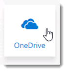
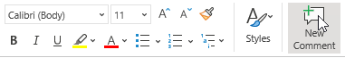

# Financial Services Guide for Customer Immersion Experience

Karen Berg, the Director of Operations and Business Strategy for Contoso Financial Partners, and has been working on a document for Contoso’s newest regional expansion.  She wants to share her document with her colleagues, Julian Isla and Molly Clark, to review and edit before sending it to the rest of the operations department.  Prior to Office 365, Karen would have emailed the document to her colleagues and scheduled individual phone calls to discuss edits—neither of which are an efficient use of Karen’s time.  But today, Karen uses a host of connected solutions to complete this process faster without sacrificing quality.

Karen will start the process going into her OneDrive where she safely saves all of her files so that they follow her across all her devices.  She will **launch Edge** from her task bar and **click** the **Home button** to automatically connect and sign into her Office 365 account.

She will select the waffle icon in the upper left-hand corner and click the OneDrive tile.

She needs to collaborate on a document with Julian and Molly.  To do this, Karen will select the Digital Banking Engagement at Contoso.docx document from her OneDrive to open it in Word Online.  She can choose to direct each of her colleagues attention to any given location within the document by using the new @mentions in comments to tag someone for feedback.

If she selects any specific text or object a the mini toolbar will appear, allowing her to choose various formatting options as well as the ability to select New Comment at the end of the mini-toolbar.

Karen will begin to enter a quick note making sure to type the @ symbol which will trigger a drop down list that she can choose the person to @mention, in this case Julian Isla.